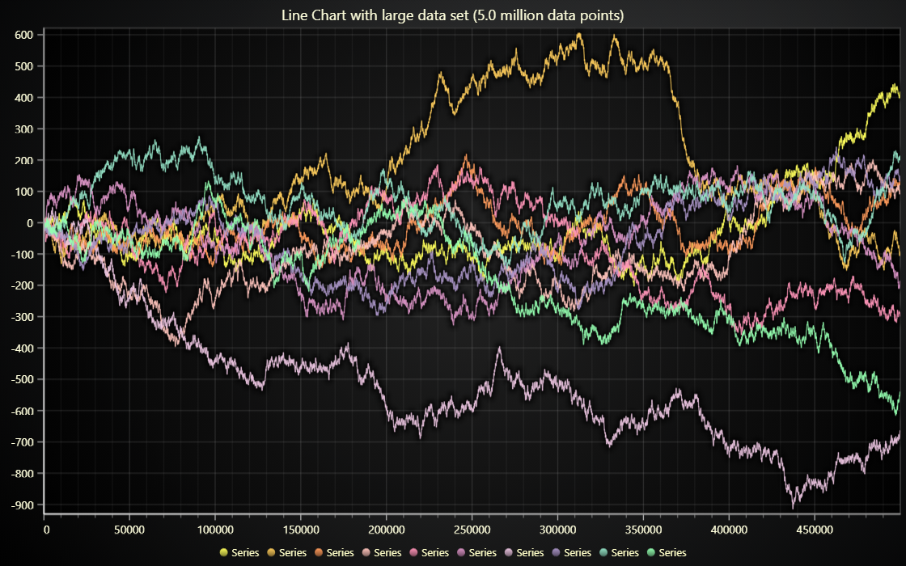

# JavaScript Large Line Chart



This demo application belongs to the set of examples for LightningChart JS, data visualization library for JavaScript.

LightningChart JS is entirely GPU accelerated and performance optimized charting library for presenting massive amounts of data. It offers an easy way of creating sophisticated and interactive charts and adding them to your website or web application.

The demo can be used as an example or a seed project. Local execution requires the following steps:

-   Make sure that relevant version of [Node.js](https://nodejs.org/en/download/) is installed
-   Open the project folder in a terminal:

          npm install              # fetches dependencies
          npm start                # builds an application and starts the development server

-   The application is available at _http://localhost:8080_ in your browser, webpack-dev-server provides hot reload functionality.


## Description

This example showcases visualization of a Line chart with relatively large data set (several millions of data points).

LightningChart JS has created a revolution with the possibilities of data visualization in web - previously Line chart visualization was realistically possible only to ranges of some hundred thousand data points and even then it required complicated developer effort to enable any zooming or panning interactions with satisfactory performance.

With LC JS a million points Line chart is loaded in less than a second and the result is unlike anything seen before - operations like zooming and panning are instantaneous.

Additionally, when compared to previous alternatives, the usage is ridiculously simple. With SVG/Canvas based drawing, users would have severe limitations with large data amounts as these technologies don't scale well.

Here's how simple the creation of a million points line chart is with LC JS:

```js
const chart = lightningChart().ChartXY()
const series = chart
    .addLineSeries({
        dataPattern: {
            pattern: 'ProgressiveX',
        },
    })
    .setStrokeStyle((stroke) => stroke.setThickness(1))
    .addArrayY(new Array(1000000).fill().map((_) => Math.random()))
```

This takes about 100 milliseconds to load and will immediately be interactable with lightning fast reactions!

The maximum possible Line chart size scales well with used hardware, especially RAM (memory) and GPU (graphics card) - On average office PC, LC JS can handle more than hundred million data points.


## API Links

* [Lightning chart]
* [Line series]
* [Chart XY]


## Support

If you notice an error in the example code, please open an issue on [GitHub][0] repository of the entire example.

Official [API documentation][1] can be found on [LightningChart][2] website.

If the docs and other materials do not solve your problem as well as implementation help is needed, ask on [StackOverflow][3] (tagged lightningchart).

If you think you found a bug in the LightningChart JavaScript library, please contact sales@lightningchart.com.

Direct developer email support can be purchased through a [Support Plan][4] or by contacting sales@lightningchart.com.

[0]: https://github.com/Arction/
[1]: https://lightningchart.com/lightningchart-js-api-documentation/
[2]: https://lightningchart.com
[3]: https://stackoverflow.com/questions/tagged/lightningchart
[4]: https://lightningchart.com/support-services/

© LightningChart Ltd 2009-2022. All rights reserved.


[Lightning chart]: https://lightningchart.com/js-charts/api-documentation/v5.1.0/functions/lightningChart-1.html
[Line series]: https://lightningchart.com/js-charts/api-documentation/v5.1.0/classes/LineSeries.html
[Chart XY]: https://lightningchart.com/js-charts/api-documentation/v5.1.0/classes/ChartXY.html

